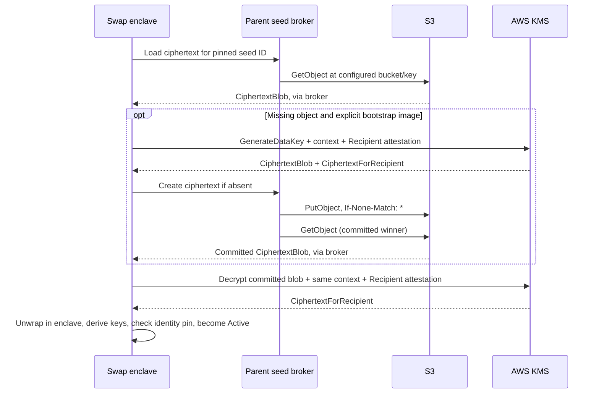

# RGB swaps: KMS seed generation and persistence

Every build with `rgb-swap` restores its signing seed through AWS KMS before
initialization can become `Active`. This includes `Dockerfile.enclave.rgb` and
the combined `Dockerfile.enclave`. The `rgb-mint-burn` and BFA mint/burn images
keep their existing generation, initialization, and cloning behavior.

KMS generates 64 random bytes with `GenerateDataKey(NumberOfBytes=64)` under a
dedicated symmetric encryption KMS key. These bytes are the seed passed to the
existing key derivation code. Transaction validation, derivation paths, and
signing algorithms are unchanged; no transaction uses KMS `Sign`.

## Official AWS dependency

The swap enclave invokes `/usr/local/bin/swap-kms-tool`, a small adapter linked
against the unmodified [AWS Nitro Enclaves SDK for C](https://github.com/aws/aws-nitro-enclaves-sdk-c/tree/cd61b6187c8b20867ba4368d1ae62c5790c0269a).
It uses the same SDK and dependency versions as AWS's `kmstool_enclave_cli`:
AWS-LC, s2n-tls, AWS Common Runtime libraries, json-c, and libnsm. The SDK handles
AWS request signing, TLS, recipient-key generation, NSM attestation, and CMS
recipient-envelope decryption. Rust retains seed persistence and signing logic.

The stock CLI exposes 16/32-byte data-key sizes and no encryption-context option.
Our adapter uses the SDK's REST API to send `GenerateDataKey(NumberOfBytes=64)`
and `Decrypt` with the existing context, then calls its CMS decryption routine.
No AWS source is patched. Credentials and sensitive results cross a bounded
stdin/stdout pipe; they are not command-line arguments or process environment.
See [the helper](../enclave/kms-tool) and [build script](../build/build-swap-kms-tool.sh).

The helper is application-owned integration code with an explicit
[maintenance and upgrade policy](../enclave/kms-tool/README.md#ownership-and-upgrade-policy).
Rust owns configuration validation; C retains bounded IPC and KMS-response
validation. Generation returns ciphertext only. Its recipient seed is validated
and wiped inside the helper before storage is allowed; only decryption of the
committed S3 blob returns a seed to Rust.

The adapter retains one reference to the SDK's CRT bootstrap until the KMS
client is destroyed. This prevents a closed HTTP connection from destroying
its event loop before connection cleanup with the pinned SDK/CRT versions.
A linker wrapper adds that reference through the official bootstrap APIs;
it leaves the SDK's transport, cryptography, and normal releases unchanged.

[The dependency manifest](../build/swap-kms-dependencies.tsv) pins every upstream
source to an immutable Git commit matching AWS's build. Both swap Dockerfiles
build static SDK/CRT libraries and ship the helper, `libnsm.so`, CA certificates,
and provenance under `/usr/share/swap-kms`. The builder uses glibc 2.31, older
than the AL2023 runtime's 2.34. Mint/burn images do not build or ship this helper.

NSM v0.4.0 does not publish a Cargo lockfile. The build supplies our checked-in
[`swap-kms-nsm.Cargo.lock`](../build/swap-kms-nsm.Cargo.lock), builds with
`--locked`, and includes that lock as `nsm-Cargo.lock` in the image provenance.
The main Rust workspace also continues to use its checked-in `Cargo.lock`
with `--locked`.

## Storage and trust boundaries



Each KMS call supplies a fresh enclave RSA recipient key and its NSM attestation.
KMS returns the seed encrypted to that recipient instead of returning plaintext.
The durable S3 object is the raw KMS `CiphertextBlob`, **not** the ephemeral
`CiphertextForRecipient`. The latter cannot be used after its enclave recipient
key is lost. See the AWS [GenerateDataKey API](https://docs.aws.amazon.com/kms/latest/APIReference/API_GenerateDataKey.html)
and [Decrypt API](https://docs.aws.amazon.com/kms/latest/APIReference/API_Decrypt.html).

The enclave authenticates HTTPS to the regional KMS hostname and signs its own
requests with temporary AWS credentials obtained from the parent broker. The
parent's KMS proxy only forwards TLS bytes. The broker handles credentials and
ciphertext; plaintext seed material stays inside KMS and the enclave.

The enclave cannot independently verify an S3 acknowledgement relayed by a
malicious parent. A parent can falsely claim that storage committed, hide an
object, or withhold service. Verify the stored object/version and backup using
a separate administrator session after bootstrap, then test recovery on a fresh
parent. This design protects seed confidentiality and checks recovered identity;
it cannot guarantee availability or durability against a dishonest storage
broker. The required restore address pin also rejects a different valid KMS
seed generated under the same context.

The ciphertext's authenticated encryption context is exactly:

```json
{
  "application": "utexo-enclave-signer",
  "flow": "rgb-swap",
  "seed_id": "YOUR_STABLE_SWAP_SIGNER_ID",
  "bitcoin_network": "bitcoin"
}
```

Use the enclave's Bitcoin network value (`bitcoin`, `testnet`, `signet`, or
`regtest`). These values are public configuration, not secrets. KMS requires the
same context when decrypting; a mismatched context cannot recover the seed.
[AWS encryption-context conditions](https://docs.aws.amazon.com/kms/latest/developerguide/conditions-kms.html#conditions-kms-encryption-context)
bind permissions to these values.

## Required configuration

Bake the following public settings into the swap EIF with the corresponding
Docker build arguments. `build/build-enclave.sh` forwards environment variables
with these names for swap image variants.

| EIF setting | Meaning |
| --- | --- |
| `SWAP_KMS_KEY_ARN` | Full ARN of a customer managed symmetric `ENCRYPT_DECRYPT` KMS key; no alias. |
| `SWAP_KMS_REGION` | Region of that key and its HTTPS endpoint. |
| `SWAP_KMS_SEED_ID` | Stable identity, unique to this logical swap signer: 1–128 ASCII letters, digits, dots, underscores, or hyphens. |
| `SWAP_KMS_ALLOW_CREATE` | `0` by default. Only `1` authorizes first-time generation when storage reports a missing object. |
| `SWAP_KMS_EXPECTED_EVM_ADDRESS` | Required EVM address pin for restore (`0x` plus 40 hex digits). Must be empty during bootstrap. Initialization fails if recovered keys differ. |

The broker uses `/etc/utexo/swap-kms.env` on the parent:

```ini
AWS_REGION=eu-central-1
SWAP_KMS_SEED_ID=swap-mainnet-signer-1
SWAP_KMS_S3_BUCKET=YOUR_DEDICATED_SEED_BUCKET
SWAP_KMS_S3_KEY=swaps/signer-1/seed.kms
SWAP_KMS_ALLOWED_CIDS=18
```

Set the actual region and assigned swap enclave CID; multiple authorized swap
CIDs can be comma-separated. The seed ID must match the EIF. The broker fixes
one bucket/key for its lifetime and rejects requests naming a different seed
ID. Use one broker configuration per logical signer identity; do not point
independent signer identities at one object. The supplied units cover one
broker on one parent.

Use a dedicated EC2 instance role with IMDSv2. Boto3 obtains and refreshes its
credentials through the normal provider chain. Do not place static access keys
in the EIF. The broker unit's `DynamicUser` and `ProtectHome` settings intentionally
do not depend on a login user's AWS profile.

| Enclave path | Parent vsock | Destination |
| --- | --- | --- |
| SDK helper, direct vsock | CID 3, port `8003` | Blind TLS relay to `kms.<region>.amazonaws.com:443` |
| `127.0.0.1:3446` | CID 3, port `8004` | Credential and ciphertext broker |

Keep the KMS relay separate from the existing EVM RPC/nginx path. Do not
terminate KMS TLS on the parent. This endpoint template targets the standard
AWS commercial partition; do not assume it supports other endpoint suffixes.

## KMS and S3 policies

Start with [the key policy template](../deploy/swap-kms-key-policy.json) and
[the bucket policy template](../deploy/swap-seed-bucket-policy.json). Replace
every `REPLACE_*` value before applying them. These files are templates; the
repository does not create or update AWS resources automatically.

The key template names separate key administrator and signer IAM roles. The
administrator must exist and retain policy-update access; do not use the
signer role as the administrator. `Resource: "*"` in a KMS key policy means the
specific key to which that policy is attached. The template intentionally
omits account-wide IAM delegation and grant creation. Review existing grants
and remove conflicting access before using an existing key. Keep the signing
role's other IAM permissions narrow; it needs no KMS policy administration.
[AWS key-policy semantics](https://docs.aws.amazon.com/kms/latest/developerguide/key-policy-overview.html)
explain these distinctions.

`GenerateDataKey` is allowed only for `REPLACE_BOOTSTRAP_PCR0`. `Decrypt` is
allowed for the bootstrap and restore PCR0 values. Both require the exact
context above. Explicit denies cover missing attestation, unapproved PCR0,
wrong or missing context, extra context keys, alternate encryption/data-key
APIs, and signer policy/grant changes. The latter prevent a parent from using
`Encrypt` to persist a seed it already knows. AWS supports recipient PCR
conditions on both operations; see [Nitro Enclaves condition keys](https://docs.aws.amazon.com/kms/latest/developerguide/conditions-nitro-enclave.html).
Never authorize all-zero debug-mode PCRs.

Use a dedicated private S3 general purpose bucket, enable versioning and Block
Public Access, and exclude seed objects from lifecycle expiration. The bucket
template grants object access only at the configured key and requires
`If-None-Match: *` for every write there. It denies object and version deletion
and prevents the signer from changing the bucket's protection settings. A
bucket-wide `ListBucket` permission lets a missing seed return `404` instead of
an ambiguous `403`; this is why the example uses a dedicated bucket. See
[GetObject permissions](https://docs.aws.amazon.com/AmazonS3/latest/API/API_GetObject.html).

Concurrent initializers adopt the ciphertext committed by the first successful
conditional write. Versioning alone does not enforce immutability: a delete
marker permits a new conditional write. Prevent deletion and lifecycle expiry,
and preserve a separate backup of the ciphertext, KMS key ARN, exact context,
and public identity. Bucket/KMS administrators remain trusted and can change
these protections. See [S3 conditional writes](https://docs.aws.amazon.com/AmazonS3/latest/userguide/conditional-writes.html)
and [bucket-policy enforcement](https://docs.aws.amazon.com/AmazonS3/latest/userguide/conditional-writes-enforce.html).

The S3 object is already encrypted with KMS. Default S3 SSE-S3 can provide its
additional storage encryption. Do not configure S3 SSE-KMS using this
attestation-only key: S3 cannot supply the enclave recipient attestation. If
organization policy requires SSE-KMS, use a separate storage key and separately
scoped S3 permissions.

## Parent installation

On the Nitro parent, from a checked-out release of this repository:

```bash
sudo install -d -m 0755 /opt/utexo-swap-kms /etc/utexo /etc/nitro_enclaves
sudo python3 -m venv /opt/utexo-swap-kms/venv
sudo /opt/utexo-swap-kms/venv/bin/pip install -r deploy/requirements-swap-kms.txt
sudo install -m 0644 deploy/swap-seed-broker.py /opt/utexo-swap-kms/swap-seed-broker.py
sudo install -m 0644 deploy/systemd/utexo-swap-seed-broker.service /etc/systemd/system/
sudo install -m 0644 deploy/systemd/vsock-proxy-kms.service /etc/systemd/system/
sudo install -m 0644 deploy/systemd/vsock-proxy-kms.yaml /etc/nitro_enclaves/
```

Create the broker environment file shown above with mode `0600`, owned by root.
Replace `REPLACE_AWS_REGION` in **both** installed KMS proxy files with the EIF's
region. Ensure the installed `vsock-proxy` path is `/usr/bin/vsock-proxy` or
adjust the unit for that host. Permit outbound HTTPS to regional KMS and S3,
and instance-role access to IMDS.

```bash
sudo systemctl daemon-reload
sudo systemctl enable --now vsock-proxy-kms.service utexo-swap-seed-broker.service
```

Start these services before issuing enclave initialization. The existing host
deployment script does not install this dedicated swap configuration. Missing
or invalid measured configuration, including a missing restore address pin,
prevents swap process startup. An unavailable broker/KMS/storage service makes
initialization fail; the operator can restore the service and retry `init`.

## Bootstrap, restart, and upgrade

1. Choose a **new** logical signer identity, dedicated object, and KMS key.
   Retain the key ARN. Do not use this procedure to replace an existing live
   signer: importing its old seed into KMS is not implemented, and a new seed
   produces different public keys. Plan an explicit signer rotation if an
   existing deployment must move from ephemeral keys.
2. Build the RGB swap EIF with public settings and `SWAP_KMS_ALLOW_CREATE=1`.
   Record `build/PCR.json`. Install the broker and relay, then authorize this
   bootstrap PCR0 in the key policy. Until the restore image is available, use
   the bootstrap PCR0 for both measurement placeholders.
3. Run the measured production EIF without debug mode. Issue
   `utexo-bridge-parent-cli --addr vsock://18:5000 init`, with the actual CID.
   Supply no seed, mnemonic, or cloning secret. Initialization must commit a
   ciphertext and successfully decrypt that committed object before exposing
   active keys. Record and verify the returned public keys and their attestation.
   Independently confirm the S3 object's existence/version and preserve a backup;
   do not rely on the parent's success response as proof of durable storage.
4. Build the normal image with the same key ARN, region, seed ID, and network,
   `SWAP_KMS_ALLOW_CREATE=0`, and the verified EVM address in
   `SWAP_KMS_EXPECTED_EVM_ADDRESS`. Record its PCR0 and update **both** the allow
   and deny measurement lists in the KMS policy before starting it. Configuration
   changes, including the creation flag and address pin, change PCR0.
5. Start the normal EIF and issue `init`. Verify that all public keys match the
   bootstrap result. Restart the enclave, repeat `init`, and compare again.
   Finish bootstrap by removing `AllowBootstrapGenerateDataKey`, removing the
   bootstrap PCR0 from both decryption measurement lists, and replacing
   `DenyGenerateDataKeyOutsideBootstrapImage` with an unconditional signer
   `kms:GenerateDataKey` deny. Retire the bootstrap EIF.

Keep bootstrap and restore artifacts at distinct locations (for example,
`OUT_DIR=build/swap-bootstrap` and `OUT_DIR=build/swap-restore`). The EIF workflow
publishes under a git-SHA path, so its two phases need distinct release commits
or separately managed publication paths. Changing repository variables at the
same SHA must not overwrite an already published image or PCR manifest.

For each subsequent code/configuration upgrade, build a restore-only EIF,
authorize its new PCR0 in both KMS decryption statements, verify recovery of
the existing identity, and retire the old measurement after rollout. Preserve
the key ARN, seed ID, network context, and ciphertext. KMS automatic rotation
under the same key is separate from changing to a different key ARN; moving
the seed to a different key is not implemented here.

Normal restarts and replicas use the same persisted ciphertext. Swap cloning
requests are rejected, so a live donor enclave and cloning secret are no longer
needed for this flow. Persistence preserves signing keys only; it does not
introduce cross-instance coordination for application state or authorize
multiple replicas to sign concurrently.

## Local development without AWS

An explicit `allow-seed-import` debug build may start with every `SWAP_KMS_*`
setting absent and initialize from a supplied test seed/mnemonic. An empty
`InitializeKey` still fails: it never falls back to an ephemeral swap seed.
Partially supplied KMS configuration is an error. This development feature is
already prohibited by the release build guard and does not alter the production
lifecycle. The in-process test harness uses an injected seed source instead of
AWS. Local emulator tests live separately on `kms-testing`; they replace NSM
attestation and transport routing only in the test helper. Production images
use the SDK's real NSM and verified HTTPS transport.

## Required live validation before production use

Local unit tests do not exercise the NSM device, actual Recipient attestation,
AWS policy evaluation, Nitro vsock, or a real S3 conditional-write race. Run the
following against disposable infrastructure and record the results before
deploying a funded signer:

| Check | Required result |
| --- | --- |
| Bootstrap then restart with restore-only EIF | Same EVM/BTC/RGB public identity; S3 ciphertext unchanged. |
| Two bootstrap initializers for one object | Both recover the committed winner; one durable object. |
| Restore-only image and a missing seed | Initialization fails; no new data key or object. |
| Wrong seed ID/network/key, malformed ciphertext, or wrong expected address | Initialization fails before `Active`. |
| Missing credentials, denied S3 access, unreachable broker/KMS | Initialization fails; no random fallback. |
| Signer-role KMS calls without Recipient or with unapproved/debug PCR0 | Both generation and decryption are denied. |
| Wrong/missing/extra encryption context and alternate KMS encryption APIs | Requests are denied. |
| Attempted unconditional overwrite or object/version deletion | S3 denies it; original ciphertext remains. |
| Unallowlisted enclave CID | Broker closes the connection before returning credentials. |
| Swap clone requests | Rejected. |
| `rgb-mint-burn` initialization, cloning, and signing regression checks | Existing behavior remains intact. |

Use the existing signing fixtures to confirm unchanged signature verification
after recovery. Do not log AWS credentials, recipient private keys, plaintext
seeds, or KMS response bodies during these checks.
